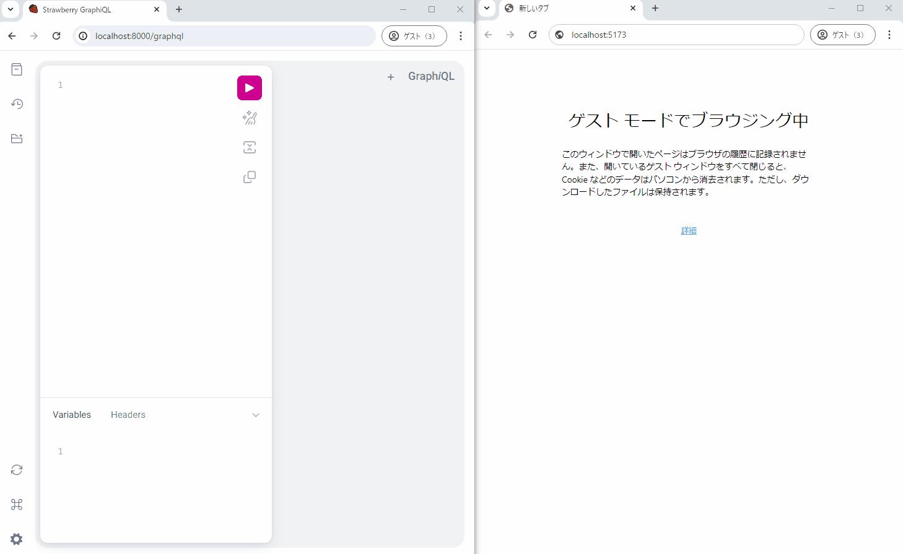

GraphQL tutorial Chat app with FastAPI/Strawberry



# How to run

```
$ # Start Redis
$ docker compose up -d redis


$ # Backend
$ cd backend/
$ python3 -m venv .venv
$ source .venv/bin/activate
(.venv) $ pip3 install -r requirements.txt
(.venv) $ # Load test data
(.venv) $ python3 scripts/seed_data.py
(.venv) $ uvicorn app.main:app --host 0.0.0.0 --port 8000

$ # Frontend
$ cd frontend/
$ yarn dev
```

- Front app: http://localhost:5173
- GraphQL debugger: http://localhost:8000/graphql
